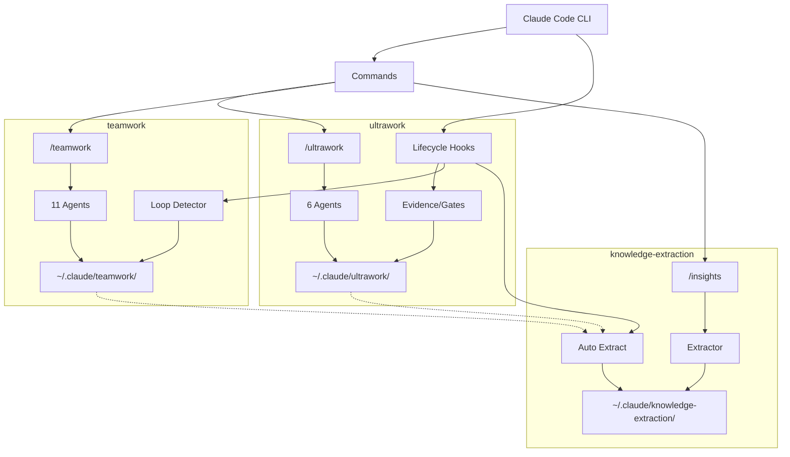

# hardworker-marketplace

Claude Code plugin marketplace focused on "hardworker" productivity patterns: verification-first development, multi-session collaboration, and evidence-based completion.

## Plugins

### ultrawork - Verification-First Development

Strict verification-first development mode with session isolation and mandatory evidence collection.

**Key Features:** Session isolation, mandatory planning with success criteria, evidence-based completion, Execute→Verify loop with auto-retry, parallel task execution, cross-platform support.

**[Full Documentation →](plugins/ultrawork/)**

### teamwork - Multi-Session Collaboration

Role-based worker agents for parallel development across multiple terminal sessions.

**Key Features:** Role-based worker agents (frontend, backend, devops, test, docs, security, review), file-per-task storage, continuous loop mode, dashboard status, project and team isolation.

**[Full Documentation →](plugins/teamwork/)**

### knowledge-extraction - Extract Knowledge from Codebases

Extract and manage knowledge from codebases for AI agent context.

**Key Features:** Pattern-based knowledge extraction, markdown documentation generation, context management for AI agents, integration with ultrawork and teamwork.

**[Full Documentation →](plugins/knowledge-extraction/)**

## Plugin Comparison

| Feature | ultrawork | teamwork | knowledge-extraction |
|---------|-----------|----------|---------------------|
| **Primary Use Case** | Solo developer, strict verification | Team collaboration, parallel work | Pattern capture, documentation |
| **Session Model** | Single session, isolated worktree | Multi-terminal, shared project | Session-based insights |
| **Verification** | Mandatory, multi-tier (task + final) | Optional, wave-based (v2) | Not applicable |
| **Evidence Collection** | Automatic via hooks | Structured via workers | Insight extraction |
| **Concurrency** | Parallel workers, single session | Multiple sessions, file locks | Single session |
| **TDD Support** | Built-in enforcement | Manual implementation | Not applicable |
| **Role Specialization** | No | Yes (8 roles) | No |
| **Planning Approach** | Mandatory exploration + planning | Goal-based or plan-based | Not applicable |
| **Retry Mechanism** | Ralph loop (execute→verify) | Fresh start mechanism | Not applicable |
| **State Storage** | `~/.claude/ultrawork/sessions/` | `~/.claude/teamwork/{project}/` | `~/.claude/knowledge-extraction/` |
| **Agent Count** | 6 (explorer, planner, worker, verifier, reviewer, scope-analyzer) | 11 (orchestrator, 8 role workers, 2 verifiers) | 1 (insight-extractor) |
| **Model Selection** | Dynamic (task complexity) | Dynamic (task complexity) | Inherit |
| **Best For** | Feature implementation, bug fixes | Large features, team projects | Learning, documentation |
| **Auto Mode** | Yes (--auto flag) | No (interactive only) | No (hook-based) |
| **Multi-Terminal** | No | Yes | No |
| **Git Integration** | Optional worktree support | Branch-based team names | No |

## Architecture Overview

### System Architecture



### Data Flow

1. **ultrawork**: Goal → Explorer → Planner → Workers (parallel) → Verifier → Complete
2. **teamwork**: Goal → Orchestrator → Tasks ← Workers (multi-terminal) → Verification → Complete
3. **knowledge-extraction**: Session → Hooks → Storage → Extract → Components

## Which Plugin Should I Use?

### Decision Guide

#### Scenario 1: Solo Developer, Single Feature Implementation

**Recommendation: ultrawork**

Use ultrawork when:
- Working alone on a well-defined feature
- Need strict verification and evidence
- Want automatic retry on failures
- Require TDD workflow enforcement
- Need session isolation (worktree support)

```bash
/ultrawork "implement user authentication with JWT"
```

#### Scenario 2: Team Collaboration, Large Feature

**Recommendation: teamwork**

Use teamwork when:
- Multiple developers working on same project
- Tasks can be parallelized across roles
- Need specialization (frontend, backend, test, etc.)
- Want continuous loop mode for unattended work
- Require wave-based verification

```bash
# Terminal 1: Coordinator
/teamwork "build REST API with authentication"

# Terminal 2-4: Workers
/teamwork-worker --role backend --loop
/teamwork-worker --role frontend --loop
/teamwork-worker --role test --loop
```

#### Scenario 3: Strict Verification Required

**Recommendation: ultrawork**

Use ultrawork when:
- Zero tolerance for incomplete work
- Need blocked pattern detection ("TODO", "FIXME")
- Require concrete evidence for every success criterion
- Want automatic execute→verify retry loop
- Need final verifier to audit all evidence

#### Scenario 4: Parallel Development Across Terminals

**Recommendation: teamwork**

Use teamwork when:
- Multiple terminal sessions needed
- Workers should claim tasks independently
- Need role-based task filtering
- Require file-based locking for concurrency
- Want fresh start mechanism for stuck workers

#### Scenario 5: Capturing Code Patterns and Insights

**Recommendation: knowledge-extraction**

Use knowledge-extraction when:
- Want to learn from past sessions
- Need to document discovered patterns
- Building reusable skills and commands
- Creating project-specific rules files
- Extracting architectural decisions

```bash
# During any session, Claude generates insights
★ Insight ─────────────────────────────────────
JWT tokens should include minimal claims.
─────────────────────────────────────────────────

# Later, extract to components
/insights extract
```

#### Scenario 6: CI/CD and Automation

**Recommendation: ultrawork --auto**

Use ultrawork auto mode when running in CI/CD pipelines with no user interaction possible, well-defined tasks with clear criteria, or need fully autonomous operation.

```bash
/ultrawork --auto "add unit tests for payment module"
```

## Skills System Overview

Plugins provide reusable skills that can be referenced by agents and commands. Skills are markdown files containing documented patterns, workflows, and best practices.

### ultrawork Skills (7 skills)

Core workflow skills: **planning** (task decomposition), **overview-exploration** (project discovery), **ultrawork** (session lifecycle), **tdd-workflow** (test-first enforcement).

Utility skills: **scripts-path-usage** (script access), **data-access-patterns** (state reading), **utility-scripts** (common patterns).

**Key Pattern:** All agents use `scripts-path-usage` for correct script invocation.

### teamwork Skills (6 skills)

Core workflow skills: **worker-workflow** (shared 5-phase task execution), **monitoring-loop** (orchestrator patterns), **task-decomposition** (parallel planning), **teamwork-clean** (project reset).

Utility skills: **scripts-path-usage**, **utility-scripts**.

**Key Pattern:** The `worker-workflow` skill is shared by all 8 role-specific workers.

### knowledge-extraction Skills (1 skill)

**insight-awareness**: Documents `★ Insight` format and automatic capture workflow. Operates primarily via hooks.

### Skills Invocation

Skills are referenced in agent frontmatter:

```yaml
---
name: worker
skills: [scripts-path-usage, data-access-patterns, worker-workflow]
---
```

Skills are also available as standalone commands in Claude Code CLI (when skill has frontmatter with `command: true`).

## Prerequisites

- **Claude Code CLI** (latest version with plugin support) - https://claude.ai/download
- **Bun 1.3+** (runtime for all plugins) - https://bun.sh/
- **Git** (version control)
- **Platform**: Windows, MacOS, or Linux

## Quick Start

### Installation

```bash
# Add marketplace
claude plugin marketplace add mnthe/hardworker-marketplace

# Install verification-first development
claude plugin install ultrawork@hardworker-marketplace

# Install multi-session collaboration
claude plugin install teamwork@hardworker-marketplace

# Install knowledge extraction
claude plugin install knowledge-extraction@hardworker-marketplace
```

### Example: ultrawork Session

```bash
# Start verification-first development session
/ultrawork "implement user authentication with JWT"

# System creates plan with tasks and success criteria
# Worker agents execute tasks in parallel
# Verifier checks all criteria with concrete evidence
# Auto-retry on failures (max 5 iterations)

# Check status
/ultrawork-status

# View collected evidence
/ultrawork-evidence

# Cancel if needed
/ultrawork-cancel
```

### Example: teamwork Session

```bash
# Terminal 1: Start coordination
/teamwork "build REST API with tests and docs"

# Terminal 2: Backend worker (continuous mode)
/teamwork-worker --role backend --loop

# Terminal 3: Test worker (continuous mode)
/teamwork-worker --role test --loop

# Terminal 4: Docs worker (one-shot)
/teamwork-worker --role docs

# Terminal 1: Check status
/teamwork-status
```

## Troubleshooting

### Issue 1: Version Mismatch Between plugin.json and marketplace.json

**Symptom:** Plugin updates not reflected after installation from marketplace.

**Cause:** `plugins/{plugin}/.claude-plugin/plugin.json` version doesn't match `.claude-plugin/marketplace.json` version.

**Solution:**

```bash
# Verify version sync
bun -e "
  const pluginVersion = require('./plugins/ultrawork/.claude-plugin/plugin.json').version;
  const marketplaceVersion = require('./.claude-plugin/marketplace.json').plugins
    .find(p => p.name === 'ultrawork').version;
  if (pluginVersion !== marketplaceVersion) {
    console.error('Version mismatch:', pluginVersion, '!=', marketplaceVersion);
    process.exit(1);
  }
  console.log('Versions match:', pluginVersion);
"
```

**Prevention:** Always update both files when bumping plugin version.

### Issue 2: Session Not Found (ultrawork)

**Symptom:** Command fails with "Session not found" error.

**Solution:** List sessions with `/ultrawork-status --all`. Verify `$CLAUDE_SESSION_ID` is set. Sessions in terminal states are auto-deleted after 7 days.

### Issue 3: Workers Not Finding Tasks (teamwork)

**Symptom:** `/teamwork-worker` exits with "No available tasks".

**Solution:** Check `/teamwork-status --verbose`. Verify project/team names match. Try general worker with `/teamwork-worker --loop` (no role filter). Use `--loop` for continuous polling.

### Issue 4: Evidence Collection Failing (ultrawork)

**Symptom:** Verifier reports "missing evidence" despite task completion.

**Solution:** View `/ultrawork-evidence`. Verify evidence includes command, output, and exit code. Check for blocked patterns ("should work", "TODO", "FIXME"). Ensure hooks are registered in hooks.json.

### Issue 5: Hook Not Triggering (all plugins)

**Symptom:** Expected hook behavior doesn't occur (evidence not collected, insights not captured, gates not enforced).

**Solution:** Verify Bun is installed (`bun --version`). Check hook registration in `hooks/hooks.json`. Test manually: `echo '{"session_id": "test"}' | bun hook-script.js`. Use explicit `bun` prefix in hooks.json for cross-platform compatibility.


## Contributing

See [CLAUDE.md](CLAUDE.md) for full development guidelines.

### Quick Guidelines

**Version Sync:** When updating plugin versions, MUST sync both `plugins/{plugin}/.claude-plugin/plugin.json` and `.claude-plugin/marketplace.json`.

**Script Requirements:**
- Flag-based parameters (no positional args)
- JSON output for structured data
- Exit codes: 0 (success), 1 (error)

**Version Bumps:**
- Patch (0.0.x): Bug fixes, typo fixes
- Minor (0.x.0): New commands/agents
- Major (x.0.0): Breaking changes

**Commit Convention:**
```
feat(plugin): Add new feature
fix(plugin): Fix bug
docs(plugin): Update documentation
refactor(plugin): Refactor code
```

## License

MIT
