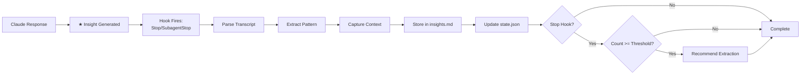
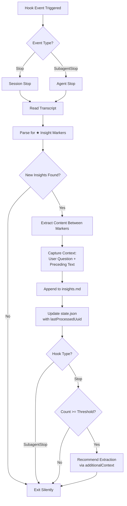
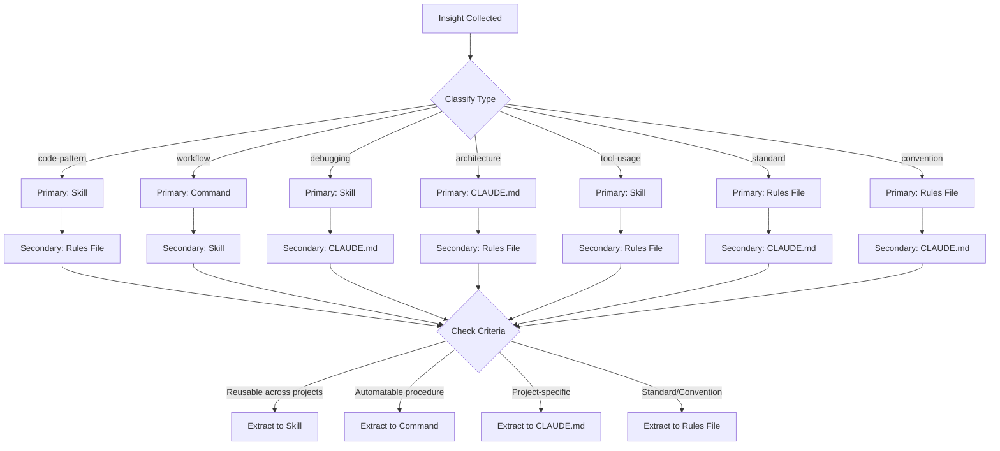

# Knowledge Extraction Plugin

Collect insights from Claude sessions and extract them into reusable components (Skills, Commands, Agents, CLAUDE.md, Rules Files).

## Overview

This plugin automatically captures valuable insights generated during Claude sessions and converts them into permanent, reusable knowledge. When Claude generates `★ Insight` markers or discovers useful patterns, they're saved to session files and can later be extracted into appropriate components.

## Features

- **Automatic Collection**: Captures insights using the `★ Insight` format
- **Session Isolation**: Each session's insights stored separately
- **Smart Classification**: Categorizes insights by type (code-pattern, workflow, debugging, etc.)
- **Threshold Alerts**: Notifies when insight count reaches configurable threshold
- **Multi-target Extraction**: Converts insights to Skills, Commands, Agents, CLAUDE.md, or Rules Files
- **Standards Compliance**: Follows CLAUDE.md and Rules File writing guidelines automatically

## Installation

### From Marketplace

```bash
claude plugin install hardworker-marketplace/knowledge-extraction
```

### Local Development

```bash
claude --plugin-dir /path/to/knowledge-extraction
```

## Usage

### Automatic Collection

Insights are **automatically extracted by hooks** - no manual action required. When Claude generates `★ Insight` markers:

```
★ Insight ─────────────────────────────────────
JWT tokens should include minimal claims. Store sensitive data server-side.
─────────────────────────────────────────────────
```

The **Stop/SubagentStop hooks** parse Claude's transcript and extract these patterns to `~/.claude/knowledge-extraction/{session-id}/insights.md`.

**Efficiency**: State tracking (`state/{session-id}.json`) ensures already-processed messages are skipped on subsequent hook calls.

## Commands

| Command             | Description                             |
| ------------------- | --------------------------------------- |
| `/insights`         | View current session's insights         |
| `/insights extract` | Extract insights to reusable components |
| `/insights clear`   | Clear current session's insights        |

## Agents

| Agent             | Model   | Purpose                           | Key Responsibilities                                                                          |
| ----------------- | ------- | --------------------------------- | --------------------------------------------------------------------------------------------- |
| insight-extractor | inherit | Convert insights to components    | Analyzes collected insights, classifies by type and extraction target, proposes component creation, executes approved extractions |

## How It Works

### Insight Collection Workflow

1. **Generation**: Claude produces insight using `★ Insight` format during conversation
2. **Hook Trigger**: Stop/SubagentStop hook fires when Claude finishes responding
3. **Transcript Parse**: Hook reads transcript, finds new messages since last processed
4. **Pattern Match**: Extracts content between `★ Insight ─────` markers
5. **Context Capture**: Saves user question + text before insight for context
6. **Storage**: Appends to `{session-id}/insights.md`
7. **State Update**: Saves last processed uuid to `state.json`
8. **Threshold Check**: (Stop only) Recommends extraction if count >= threshold



### Extraction Workflow

1. Insights are collected during normal Claude usage
2. When threshold reached (default: 5), hook recommends extraction
3. Run `/insights extract` to launch the extractor agent
4. Agent analyzes and proposes extraction targets
5. Approve proposals to create components
6. Session file is cleaned up after extraction

### Insight Format Integration

```
★ Insight ─────────────────────────────────────
[key educational points]
─────────────────────────────────────────────────
```

**Automatic workflow:**
1. Claude generates `★ Insight` block (visible to user)
2. Hook parses transcript after response completes
3. Extracts content between markers
4. Saves to session file with context
5. Recommends extraction when threshold reached

### Hook Behavior

- **Stop Hook**: Automatically extracts `★ Insight` patterns from Claude's responses and saves to session file. Also recommends extraction when threshold reached.
- **SubagentStop Hook**: Extracts insights from subagent responses (extraction only, no recommendations)



### Extraction Targets

| Insight Type   | Primary Target | Secondary Target | Criteria                            |
| -------------- | -------------- | ---------------- | ----------------------------------- |
| `code-pattern` | Skill          | Rules File       | Reusable patterns across projects   |
| `workflow`     | Command        | Skill            | Automatable step-by-step procedures |
| `debugging`    | Skill          | CLAUDE.md        | Troubleshooting techniques          |
| `architecture` | CLAUDE.md      | Rules File       | Project-specific decisions          |
| `tool-usage`   | Skill          | Rules File       | Effective tool combinations         |
| `standard`     | Rules File     | CLAUDE.md        | Standards, conventions, formatting  |
| `convention`   | Rules File     | CLAUDE.md        | Naming conventions, file patterns   |



### Rules Files

Rules files (`.claude/rules/*.rules`) are created for reusable standards that can be referenced from multiple places:

- Documentation standards
- Code style guidelines
- Testing requirements
- Workflow procedures

The insight-extractor follows strict formatting guidelines when creating Rules files, including:
- Proper file naming (`topic-name.rules`)
- Required section structure
- Evidence-based language (no speculation)
- Consistent markdown formatting

## Configuration

Create `~/.claude/knowledge-extraction/config.local.md` to customize:

```yaml
---
threshold: 5
auto_recommend: true
---

# Knowledge Extraction Configuration

Customize insight collection and extraction behavior.
```

### Options

| Option           | Default | Description                             |
| ---------------- | ------- | --------------------------------------- |
| `threshold`      | 5       | Insights before recommending extraction |
| `auto_recommend` | true    | Show extraction recommendations         |

## Storage

Insights and state are stored per-session:

```
~/.claude/knowledge-extraction/
├── config.local.md              # Configuration (optional)
└── {session-id}/
    ├── state.json               # Processing state (last processed uuid)
    └── insights.md              # Collected insights with context
```

### Insight Format

Each insight includes context for better understanding:

```markdown
## 2026-01-11T22:10:30+09:00

### User Question

> How should I manage complex form state in React?

### Context

I've been looking at different approaches for form state management.

### Content

When managing complex form state with multiple interdependent fields, prefer useReducer over multiple useState calls.

---
```

## Workflows

### Skill: insight-awareness

Guides Claude to recognize and save insights. Triggers when:
- Generating `★ Insight` markers
- Discovering code patterns
- Finding debugging solutions
- Making architectural decisions

### Command: /insights

User-facing command for managing insights.

### Agent: insight-extractor

Autonomous agent that:
- Analyzes collected insights
- Classifies by type and extraction target
- Proposes component creation
- Executes approved extractions

### Hooks

- **Stop Hook**: Automatically extracts `★ Insight` patterns from Claude's responses and saves to session file. Also recommends extraction when threshold reached.
- **SubagentStop Hook**: Extracts insights from subagent responses (extraction only, no recommendations)

## Troubleshooting

### No Insights Appearing

```bash
# Check if session directory exists
ls ~/.claude/knowledge-extraction/

# Verify state file
cat ~/.claude/knowledge-extraction/{session-id}/state.json

# Ensure ★ Insight format is correct (must have exact markers)
```

### Hook Not Triggering

- Verify hooks are enabled in Claude Code settings
- Check that Bun runtime is available
- Confirm hook file permissions are executable
- Review Claude Code logs for hook execution errors

### Duplicate Insights

State tracking should prevent duplicates. If duplicates occur:
- Delete `~/.claude/knowledge-extraction/{session-id}/state.json`
- Restart Claude session
- Hook will reprocess with fresh state

### Extraction Failed

```bash
# View current session's insights
/insights

# Clear and retry extraction
/insights clear
/insights extract
```

Common issues:
- Insufficient insights (need descriptive content)
- Missing context (user question not captured)
- Invalid insight format (missing markers)

## Requirements

- Claude Code CLI
- Bun (for hooks)

## License

MIT
