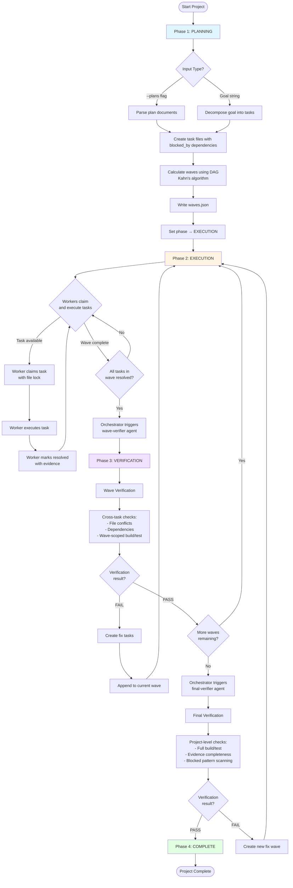
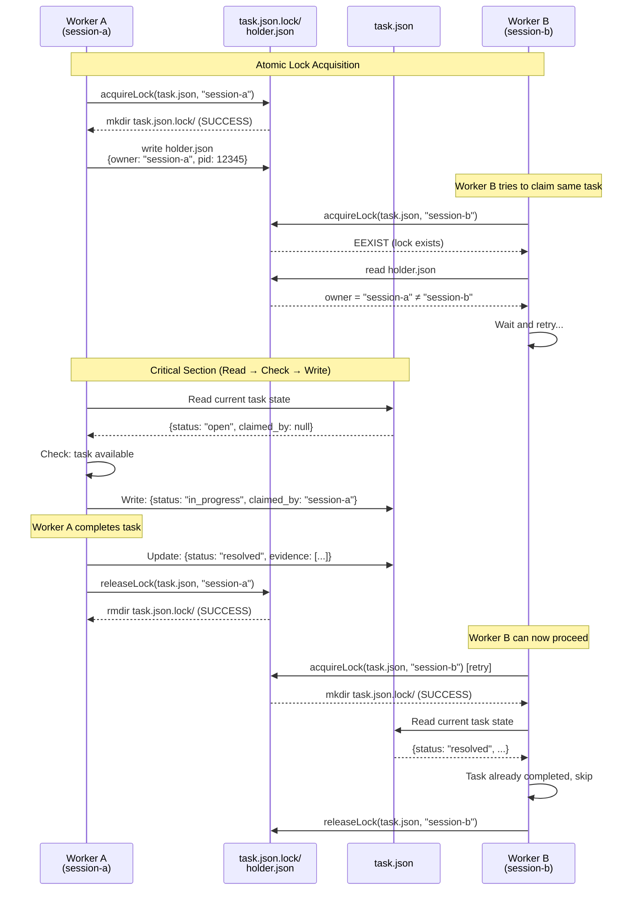

# teamwork

Multi-session collaboration plugin with role-based workers, file-per-task storage, and parallel execution support.

## Overview

Teamwork enables distributed collaboration across multiple Claude sessions. The unified orchestrator handles project planning, monitoring, and verification orchestration, while specialized workers claim and execute tasks in parallel. Each worker runs in its own terminal session, coordinating through shared task files with optimistic concurrency control.

**Key capabilities:**
- Unified orchestrator for planning, monitoring, and verification (v2)
- Role-based task assignment (frontend, backend, test, devops, etc.)
- Wave-based parallel execution with dependency management (v2)
- Three-tier verification (task, wave, project levels) (v2)
- Optimistic concurrency control (OCC) for conflict-free operations (v2)
- Fresh start mechanism for releasing stuck tasks (v2)
- Continuous loop mode for unattended execution
- Dashboard status view with wave progress tracking
- Cross-platform support (Windows, MacOS, Linux)

## Features

- **Wave-Based Execution** (v2): Tasks organized into parallel execution waves based on dependencies
- **Parallel Execution**: Multiple workers run simultaneously in separate terminals
- **Role Specialization**: Workers filter tasks by role (frontend, backend, test, etc.)
- **Three-Tier Verification** (v2): Task-level, wave-level, and final project verification
- **Structured Evidence** (v2): Command outputs, file changes, and test results tracked systematically
- **Optimistic Concurrency Control** (v2): Timestamp-based conflict detection prevents race conditions without file locks
- **Fresh Start Mechanism** (v2): Automatic release of stuck tasks after configurable timeout
- **Loop Mode**: Workers automatically claim next task until project complete
- **Progress Dashboard**: Real-time status view with wave progress and completion metrics
- **Zero Build Step**: Pure JavaScript with JSDoc types (no TypeScript compilation)

## Installation

### From Marketplace

```bash
claude plugin marketplace add mnthe/hardworker-marketplace
claude plugin install teamwork@hardworker-marketplace
```

### Local Development

```bash
claude --plugin-dir /path/to/teamwork
```

## Usage

### Basic Workflow (v2 with Waves)

```bash
# Terminal 1: Start project with plan documents (enables wave execution)
/teamwork --plans docs/plan1.md docs/plan2.md

# Or with goal (traditional mode)
/teamwork "build REST API with authentication and tests"

# Terminal 2: Start backend worker
/teamwork-worker --role backend --loop

# Terminal 3: Start frontend worker
/teamwork-worker --role frontend --loop

# Terminal 4: Check progress with wave visualization
/teamwork-status

# Terminal 5 (optional): Manual verification trigger
/teamwork-verify --wave 2
```

### Traditional Workflow (v1 compatibility)

```bash
# Terminal 1: Start project (coordination)
/teamwork "build REST API with authentication and tests"

# Terminal 2: Start backend worker
/teamwork-worker --role backend --loop

# Terminal 3: Start frontend worker
/teamwork-worker --role frontend --loop

# Terminal 4: Check progress
/teamwork-status
```

### One-Shot Worker

```bash
# Complete one task then exit
/teamwork-worker
```

### Continuous Worker

```bash
# Keep claiming tasks until project complete
/teamwork-worker --loop

# Specialized continuous worker
/teamwork-worker --role backend --loop
```

### Status Dashboard

```bash
# Basic status
/teamwork-status

# Detailed task list
/teamwork-status --verbose
```

## Commands

| Command            | Description                                             | Options                                                                   |
| ------------------ | ------------------------------------------------------- | ------------------------------------------------------------------------- |
| `/teamwork <goal>` | Start coordination session, create task breakdown       | `--project NAME`, `--team NAME`, `--plans FILE...` (v2)                   |
| `/teamwork-status` | View dashboard with progress metrics and active workers | `--project NAME`, `--team NAME`, `--verbose`                              |
| `/teamwork-worker` | Claim and complete one task (one-shot mode)             | `--loop`, `--role ROLE`, `--strict` (v2), `--project NAME`, `--team NAME` |
| `/teamwork-verify` | Trigger manual verification (v2)                        | `--wave N`, `--final`, `--project NAME`, `--team NAME`                    |
| `/teamwork-clean`  | Clean project by deleting task and verification directories | `--project NAME`, `--team NAME`                                      |

### Options

#### /teamwork

| Option           | Description                                    |
| ---------------- | ---------------------------------------------- |
| `--project NAME` | Override project name (default: git repo name) |
| `--team NAME`    | Override team name (default: git branch name)  |
| `--plans FILE...` | (v2) Plan documents to parse for wave-based execution |

#### /teamwork-worker

| Option           | Default | Description                                             |
| ---------------- | ------- | ------------------------------------------------------- |
| `--loop`         | false   | Continuous mode - keep working until all tasks complete |
| `--role ROLE`    | (none)  | Only claim tasks assigned to this role                  |
| `--strict`       | false   | (v2) Require structured evidence (ultrawork-level verification) |
| `--fresh-start-interval` | 3600 | (v2) Release stuck tasks after N seconds (0 = disabled) |
| `--project NAME` | (auto)  | Override project name detection                         |
| `--team NAME`    | (auto)  | Override team name detection                            |

#### /teamwork-status

| Option           | Description                                       |
| ---------------- | ------------------------------------------------- |
| `--project NAME` | Override project name detection                   |
| `--team NAME`    | Override team name detection                      |
| `--verbose`      | Show detailed task list with status and ownership |

#### /teamwork-verify (v2)

| Option           | Description                                       |
| ---------------- | ------------------------------------------------- |
| `--wave N`       | Verify specific wave (cross-task checks)          |
| `--final`        | Run final project verification                    |
| `--project NAME` | Override project name detection                   |
| `--team NAME`    | Override team name detection                      |

## Agents

| Agent               | Model   | Purpose                   | Key Responsibilities                                            |
| ------------------- | ------- | ------------------------- | --------------------------------------------------------------- |
| **orchestrator**    | opus    | Unified Planning, Monitoring & Verification | Codebase exploration, task decomposition, wave monitoring, trigger verifiers, handle conflicts, coordinate verification phases, fresh start detection |
| **wave-verifier**   | sonnet  | Wave-Level Verification   | Cross-task dependency checking, file conflict detection, wave-scoped build/test execution |
| **final-verifier**  | opus    | Project-Level Verification | Full build/test, blocked pattern scanning, evidence completeness, cross-wave dependency validation |
| **coordinator**     | opus    | Planning (DEPRECATED)     | **Deprecated in v2:** Use orchestrator instead. Kept for backward compatibility only. |
| **frontend**        | inherit | UI Implementation         | UI components, styling, state management, user interactions, responsive design, accessibility |
| **backend**         | inherit | API Implementation        | API endpoints, services, database, business logic, data validation |
| **test**            | inherit | Testing                   | Unit tests, integration tests, fixtures, mocks, test coverage |
| **devops**          | inherit | Infrastructure            | CI/CD, deployment, infrastructure, containerization, monitoring |
| **docs**            | inherit | Documentation             | README, API docs, examples, architectural documentation |
| **security**        | inherit | Security                  | Authentication, authorization, input validation, security audits |
| **review**          | inherit | Code Review               | Code quality, refactoring, best practices, architecture review |
| **worker**          | inherit | General Purpose           | Find available tasks, claim with file lock, implement, collect structured evidence, mark resolved |

## How It Works

### Architecture Diagram

```
┌──────────────────────────────────────────────┐
│      Orchestrator (Unified, Opus Model)      │
│   Planning → Monitoring → Verification       │
└───────────────────┬──────────────────────────┘
                    │
    ┌───────────────┴────────────────┐
    ▼                                ▼
┌────────────────────┐    ┌────────────────────┐
│   Workers (8 types) │    │  Verification      │
│   - frontend        │    │  - wave-verifier   │
│   - backend         │    │  - final-verifier  │
│   - test, devops    │    └────────────────────┘
│   - docs, security  │
│   - review, worker  │
└────────────────────┘

         All coordinate via:
    ┌──────────────────────────┐
    │  Shared Task Files       │
    │  (Optimistic Concurrency)│
    └──────────────────────────┘
```

### Phase 1: Planning

```
/teamwork "build REST API"
    ↓
Orchestrator agent spawned (uses Opus model)
    ↓
Analyzes codebase and requirements
    ↓
Creates task breakdown with roles
    ↓
Calculates wave dependencies (v2)
    ↓
Writes task files to shared directory
```

### Phase 2: Parallel Execution

```
Terminal 1: /teamwork-worker --role backend --loop
    ↓ (claims task #1: "Setup database schema")
    ↓ (completes task, marks resolved)
    ↓ (claims task #2: "Build API endpoints")

Terminal 2: /teamwork-worker --role frontend --loop
    ↓ (claims task #3: "Create login form")
    ↓ (completes task, marks resolved)
    ↓ (claims task #4: "Build dashboard")
```

### Phase 3: Monitoring

```
Terminal 3: /teamwork-status --verbose
    ↓
Shows progress dashboard:
- Overall completion percentage
- Per-role completion metrics
- Active workers and claimed tasks
- Blocked tasks waiting on dependencies
```

### Phase 4: Verification (v2)

```
Wave N completed (all tasks resolved)
    ↓
Orchestrator detects completion
    ↓
Triggers wave-verifier agent
    ↓
Cross-task checks:
- File conflict detection
- Dependency validation
- Wave-scoped build/test
    ↓
Results: PASS → next wave | FAIL → fix tasks added
    ↓ (if final wave passed)
Triggers final-verifier agent
    ↓
Project-level checks:
- Full build/test
- Evidence completeness
- Blocked pattern scanning
    ↓
Results: PASS → COMPLETE | FAIL → new fix wave
```

#### Wave-Based Execution Flow (v2)



### Concurrency Safety (v2)

Teamwork handles multiple workers accessing shared state with file-based locking:

**File Lock with Owner Identification:**
- Workers use mkdir-based atomic file locks for task claims
- Lock holder info stored in `holder.json` (owner, pid, timestamp)
- Reentrant locks: same owner can re-acquire without waiting
- Stale lock detection: auto-cleanup if holder process is dead (>1 min)
- Cross-platform: works on Windows, macOS, Linux

#### Worker Coordination Sequence



**Benefits:**
- No race conditions (atomic mkdir + holder identification)
- Reentrant: same session can claim multiple tasks
- Stale lock recovery: auto-cleanup crashed sessions
- Cross-platform compatibility

## Configuration

### Command Options

Teamwork is configured via command-line flags:

| Option           | Default             | Description                              |
| ---------------- | ------------------- | ---------------------------------------- |
| `--project`      | Git repo name       | Override project name                    |
| `--team`         | Git branch name     | Override team name                       |
| `--role`         | none (all roles)    | Filter tasks by role                     |
| `--loop`         | false               | Continuous mode (claim tasks until done) |
| `--verbose`      | false               | Show detailed task information           |

### Role Assignment

Tasks are assigned roles during coordination phase:

| Role         | Use Cases                                      |
| ------------ | ---------------------------------------------- |
| `frontend`   | UI components, styling, user interactions      |
| `backend`    | API endpoints, services, database              |
| `test`       | Unit tests, integration tests                  |
| `devops`     | CI/CD, deployment, infrastructure              |
| `docs`       | Documentation, README, examples                |
| `security`   | Authentication, authorization, validation      |
| `review`     | Code review, refactoring suggestions           |
| `worker`     | General purpose (claims any role)              |

## Storage

### Directory Structure

```
~/.claude/teamwork/{project}/{team}/
├── project.json              # Project metadata and statistics
├── waves.json                # Wave definitions and progress (v2)
├── tasks/
│   ├── 1.json                # Individual task files
│   ├── 2.json
│   └── ...
└── verification/             # Verification results (v2)
    ├── wave-1.json
    ├── wave-2.json
    └── final.json
```

### Task File Format

```json
{
  "id": "1",
  "title": "Setup database schema",
  "description": "Create user and post tables with migrations",
  "role": "backend",
  "status": "open",
  "blocked_by": [],
  "wave": 1,
  "created_at": "2026-01-12T10:30:00Z",
  "updated_at": "2026-01-12T10:30:00Z",
  "claimed_by": null,
  "claimed_at": null,
  "completed_at": null,
  "evidence": [
    {
      "type": "command",
      "command": "npm run migrate",
      "output": "Migration completed successfully",
      "exit_code": 0,
      "timestamp": "2026-01-12T10:35:00Z"
    },
    {
      "type": "file",
      "action": "created",
      "path": "prisma/migrations/001_users/migration.sql",
      "timestamp": "2026-01-12T10:34:00Z"
    }
  ]
}
```

**Task statuses:**
- `open`: Available for claiming
- `in_progress`: Claimed by a worker
- `resolved`: Completed with evidence

**Evidence types (v2):**
- `command`: Command execution with exit code
- `file`: File operations (created, modified, deleted)
- `test`: Test results with pass/fail counts
- `note`: General observations

### Project File Format

```json
{
  "project": "my-app",
  "team": "feature-auth",
  "goal": "Build REST API with authentication",
  "phase": "EXECUTION",
  "created_at": "2026-01-12T10:30:00Z",
  "updated_at": "2026-01-12T10:35:00Z",
  "stats": {
    "total": 10,
    "open": 3,
    "in_progress": 2,
    "resolved": 5
  }
}
```

**Phase values (v2):**
- `PLANNING`: Orchestrator is analyzing and creating tasks
- `EXECUTION`: Workers are claiming and completing tasks
- `VERIFICATION`: Wave or final verification in progress
- `COMPLETE`: All tasks verified and project finished

### Wave State Format (v2)

```json
{
  "version": "1.0",
  "total_waves": 3,
  "current_wave": 2,
  "waves": [
    {
      "id": 1,
      "status": "verified",
      "tasks": ["1", "2", "3"],
      "started_at": "2026-01-15T10:00:00Z",
      "verified_at": "2026-01-15T10:30:00Z"
    },
    {
      "id": 2,
      "status": "in_progress",
      "tasks": ["4", "5"],
      "started_at": "2026-01-15T10:30:00Z",
      "verified_at": null
    },
    {
      "id": 3,
      "status": "pending",
      "tasks": ["6", "7", "8"],
      "started_at": null,
      "verified_at": null
    }
  ]
}
```

**Wave status values:**
- `planning`: Wave is being prepared
- `in_progress`: Workers are completing tasks in this wave
- `completed`: All tasks resolved, awaiting verification
- `verified`: Wave verification passed
- `failed`: Wave verification failed

### Verification Result Format (v2)

```json
{
  "wave_id": 1,
  "status": "passed",
  "verified_at": "2026-01-15T10:30:00Z",
  "tasks_verified": ["1", "2", "3"],
  "checks": [
    {
      "name": "all_tasks_resolved",
      "status": "passed"
    },
    {
      "name": "no_file_conflicts",
      "status": "passed"
    },
    {
      "name": "build_succeeds",
      "status": "passed",
      "evidence": "npm run build: exit 0"
    }
  ],
  "issues": []
}
```

**Verification status values:**
- `passed`: All checks passed, wave can proceed
- `failed`: One or more checks failed, fix tasks required

## Workflows

### Interactive Workflow

```bash
# Terminal 1: Start project coordination
/teamwork "build todo app with React frontend and Express backend"

# Terminal 2: Backend specialist
/teamwork-worker --role backend --loop

# Terminal 3: Frontend specialist
/teamwork-worker --role frontend --loop

# Terminal 4: Test specialist
/teamwork-worker --role test --loop

# Terminal 5: Monitor progress
/teamwork-status
```

### Single Developer Workflow

```bash
# Start project
/teamwork "implement user authentication"

# Work on one task at a time
/teamwork-worker

# Check what's left
/teamwork-status

# Continue with next task
/teamwork-worker
```

### Loop Mode Workflow

Loop mode uses hook-based continuation for unattended execution:

1. Worker completes a task
2. Outputs special marker: `__TEAMWORK_CONTINUE__`
3. Stop hook detects marker and checks for more tasks
4. Hook re-triggers `/teamwork-worker` with same context
5. Loop continues until no open tasks remain

**Loop state tracking:**
- State stored per-terminal in `~/.claude/teamwork/.loop-state/{pid}.json`
- Preserves project, team, and role filter across iterations
- Automatically cleaned up when loop exits

**Fresh start mechanism (v2):**
- Orchestrator monitors task claim timestamps
- Tasks stuck in `in_progress` for longer than `--fresh-start-interval` seconds are released
- Default: 3600 seconds (1 hour)
- Prevents workers from blocking tasks indefinitely if they hang or crash
- Workers can detect task release and abandon work gracefully
- Configurable via `--fresh-start-interval N` (0 to disable)

#### Fresh Start Mechanism Flow

```mermaid
flowchart TD
    Start([Orchestrator Monitoring Loop]) --> CheckInterval[Check fresh-start-interval setting]
    CheckInterval --> IntervalSet{Interval > 0?}
    IntervalSet -->|No disabled| SkipFreshStart[Skip fresh start checks]
    SkipFreshStart --> Start
    IntervalSet -->|Yes| ScanTasks[Scan all tasks in project]

    ScanTasks --> CheckTask{For each task:<br/>status = in_progress?}
    CheckTask -->|No| NextTask[Check next task]
    NextTask --> ScanTasks
    CheckTask -->|Yes| GetClaimTime[Get claimed_at timestamp]
    GetClaimTime --> CalcAge[Calculate age:<br/>now - claimed_at]
    CalcAge --> AgeCheck{Age > interval?}
    AgeCheck -->|No| NextTask
    AgeCheck -->|Yes| StuckTask[Task is stuck!]

    StuckTask --> ReleaseTask[Release task:<br/>- Clear claimed_by<br/>- Reset claimed_at<br/>- Keep status = in_progress]
    ReleaseTask --> LogEvent[Log fresh start event:<br/>"Task X released after Y seconds"]
    LogEvent --> NotifyWorker{Worker still<br/>processing?}
    NotifyWorker -->|Yes| WorkerDetects[Worker detects task released<br/>on next file operation]
    WorkerDetects --> WorkerAbandons[Worker abandons work<br/>without committing]
    NotifyWorker -->|No crashed| TaskAvailable[Task now available<br/>for other workers]
    WorkerAbandons --> TaskAvailable
    TaskAvailable --> NextTask

    style StuckTask fill:#ffe1e1
    style ReleaseTask fill:#fff4e1
    style TaskAvailable fill:#e1ffe1
```

**Configuration:**

```bash
# Start continuous worker (default: 1 hour fresh start)
/teamwork-worker --loop

# Or with role specialization
/teamwork-worker --role backend --loop

# With custom fresh start interval (30 minutes)
/teamwork-worker --loop --fresh-start-interval 1800

# Disable fresh start (not recommended)
/teamwork-worker --loop --fresh-start-interval 0
```

### Project Override Workflow

```bash
# Work on specific project/team combination
/teamwork-worker --project myapp --team bugfix-123 --loop
```

## Troubleshooting

### Worker Not Finding Tasks

```bash
# Check if tasks exist
/teamwork-status --verbose

# Verify project and team names match
/teamwork-status --project myapp --team feature-123
```

### Tasks Not Being Claimed

```bash
# Check role filter - workers with --role only claim matching tasks
/teamwork-worker --role backend

# Use general worker to claim any role
/teamwork-worker
```

### Multiple Workers Claiming Same Task

This should not happen due to file-based locking with owner identification. If it does:
- Check filesystem supports atomic mkdir operations
- Verify lock directories (`*.json.lock/`) are not being corrupted
- Check that holder.json files contain valid session IDs
- Stale lock detection should auto-cleanup after 1 minute if holder process is dead
- File locks work reliably across all filesystems (including NFS)

### Loop Mode Not Continuing

```bash
# Check loop state file
cat ~/.claude/teamwork/.loop-state/{pid}.json

# Verify stop hook is registered
# Loop mode requires hook system to be active
```

### Project State Corruption

```bash
# Task files are individual JSON files
# If corrupted, manually fix the specific task file
nano ~/.claude/teamwork/{project}/{team}/tasks/{id}.json

# Or delete corrupted task and recreate
rm ~/.claude/teamwork/{project}/{team}/tasks/{id}.json
```

## Backward Compatibility

Teamwork v2 maintains full backward compatibility with v1:

### Compatibility Matrix

| Feature | v1 Behavior | v2 Behavior | Migration Required |
|---------|-------------|-------------|-------------------|
| **Commands** | `/teamwork`, `/teamwork-worker`, `/teamwork-status` | Same + `/teamwork-verify` | No - all v1 commands work |
| **Evidence** | Simple strings | Structured objects | No - both formats supported |
| **Waves** | Not used | Optional wave execution | No - enabled via `--plans` flag |
| **Verification** | Manual | Automatic (if waves.json exists) | No - opt-in |

### Migration Paths

**Existing Projects (v1 → v2)**:
1. Continue using v1 mode (no changes needed)
2. Add `waves.json` manually to enable wave verification
3. Use `--plans` flag on new projects for wave support

**New Projects**:
- Use `--plans` flag: Enables wave-based execution and verification
- Use goal string: Traditional v1 mode without waves

**Mixed Mode**:
- v1 projects can adopt wave verification by adding `waves.json`
- Workers support both evidence formats simultaneously
- Dashboard shows wave progress if waves.json exists, otherwise traditional view

## Requirements

- **Claude Code CLI**: Latest version with plugin support
- **Bun**: 1.3+ for script execution
- **Git**: For project/team name detection (optional)
- **Platform**: Windows, MacOS, or Linux
- **Filesystem**: Must support atomic file operations

## License

MIT
