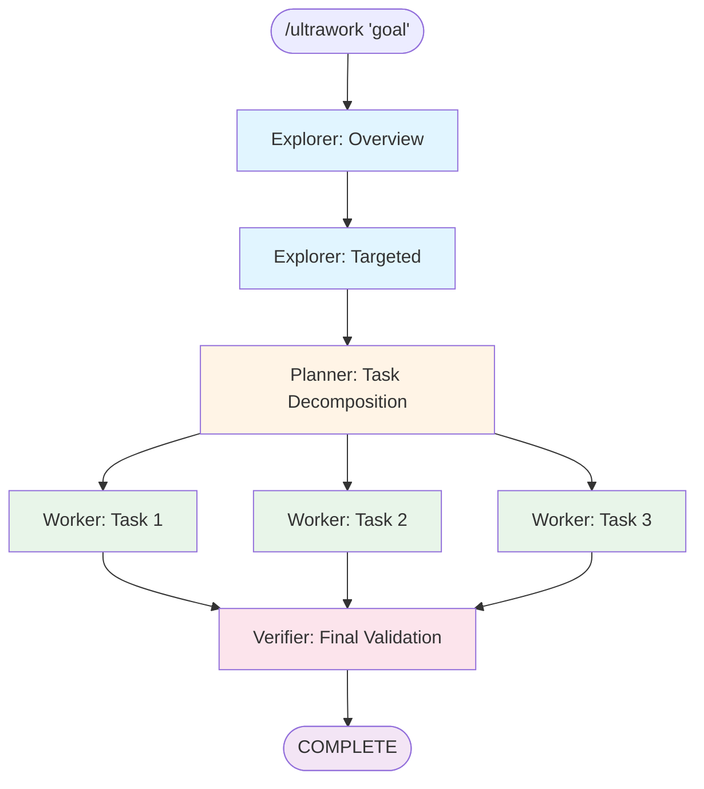
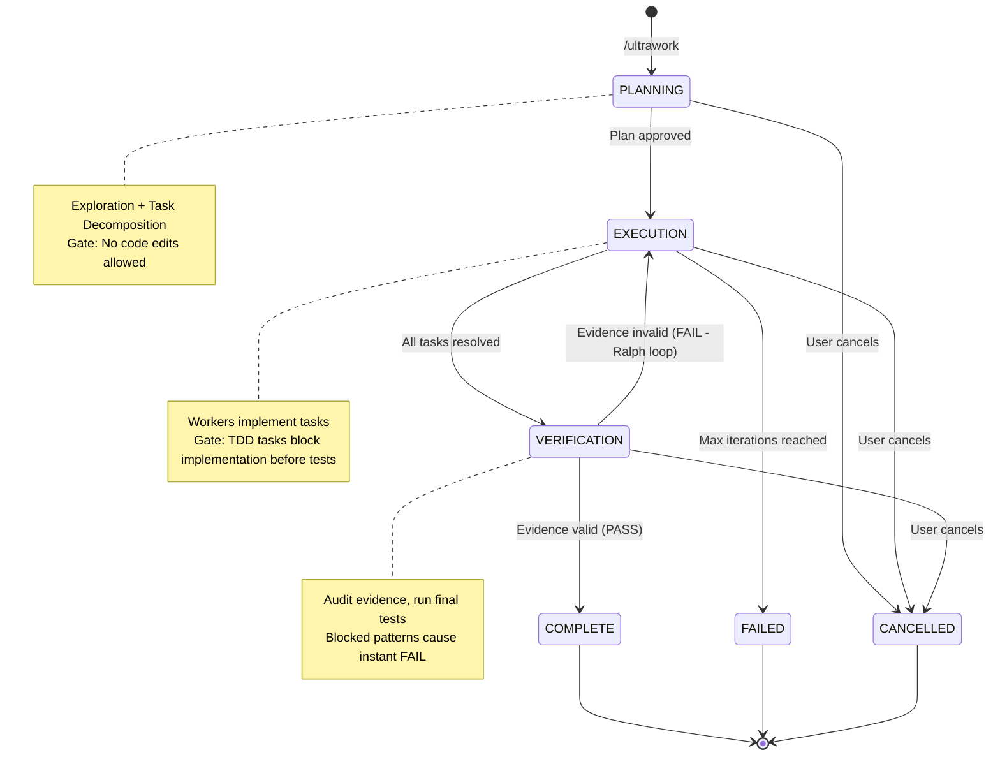
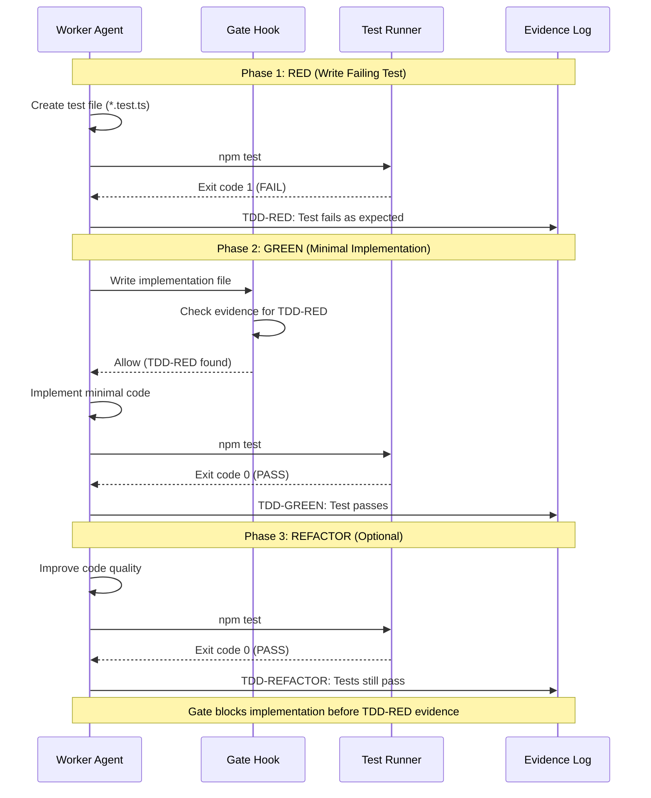

# ultrawork

Strict verification-first development mode with Session ID-based isolation.

## Overview

Ultrawork enforces rigorous development practices through automated planning, evidence-based completion, and zero tolerance for partial implementations. Every task requires success criteria defined BEFORE implementation, and completion is only accepted when backed by concrete evidence (test results, command outputs, exit codes).

The plugin operates in isolated sessions, where each development goal goes through structured phases:
1. **Exploration**: Automated codebase discovery via explorer agents
2. **Planning**: Task decomposition with dependency graphs
3. **Execution**: Parallel worker execution with evidence collection
4. **Verification**: Strict validation of all success criteria

## Features

- **Mandatory Planning**: Every goal requires upfront planning with success criteria
- **Evidence-Based Completion**: No speculative language allowed ("should work", "probably works")
- **Session Isolation**: Each goal runs in isolated session with unique UUID
- **Automated Exploration**: Explorer agents discover codebase patterns before planning
- **Parallel Execution**: Workers run concurrently with configurable limits
- **Execute-Verify Loop**: Automatic retry on verification failure (Ralph loop pattern)
- **TDD Support**: Built-in Test-Driven Development workflow enforcement
- **Zero Tolerance**: Blocked patterns ("TODO", "FIXME", "basic implementation") fail verification
- **Cross-Platform**: JavaScript/Bun implementation works on Windows, MacOS, Linux
- **Interactive Mode**: User approval at decision points (authentication method, architecture choices)
- **Auto Mode**: Fully autonomous operation for CI/CD and well-defined tasks
- **Worktree Support**: Isolated git worktree for each session (v6.1+)

## Installation

### From Marketplace

```bash
claude plugin marketplace add mnthe/hardworker-marketplace
claude plugin install ultrawork@hardworker-marketplace
```

### Local Development

```bash
claude --plugin-dir /path/to/hardworker-marketplace/plugins/ultrawork
```

## Usage

### Basic Commands

```bash
# Full workflow (plan + execute)
/ultrawork "implement user authentication"

# Auto mode (no user interaction)
/ultrawork --auto "fix login bug"

# Plan only (review before execution)
/ultrawork-plan "add payment processing"

# Execute existing plan
/ultrawork-exec

# Check session status
/ultrawork-status

# Show collected evidence
/ultrawork-evidence

# Clean up sessions
/ultrawork-clean

# Show help
/ultrawork-help
```

### Command Options

#### /ultrawork

```bash
/ultrawork [options] <goal>

Options:
  --auto              Skip user interaction, auto-decide everything
  --max-workers N     Limit concurrent workers (default: unlimited)
  --max-iterations N  Max execute-verify retry loops (default: 5)
  --skip-verify       Skip verification phase (fast mode)
  --plan-only         Stop after planning, don't execute
  --worktree          Create isolated git worktree for session (v6.1+)
```

Examples:

```bash
# Feature implementation with user interaction
/ultrawork "implement JWT authentication"

# Auto mode for well-defined tasks
/ultrawork --auto "add unit tests for auth module"

# Limit parallel workers
/ultrawork --max-workers 3 "refactor database layer"

# Plan only (dry run)
/ultrawork --plan-only "migrate to TypeScript"

# Fast mode (skip verification)
/ultrawork --skip-verify "fix typo in documentation"

# Isolated worktree (v6.1+)
/ultrawork --worktree "implement payment integration"
```

#### /ultrawork-plan

```bash
/ultrawork-plan [options] <goal>

Options:
  --auto    Auto-decide during planning (no user questions)
```

Creates planning documents without execution. Outputs:
- `docs/plans/YYYY-MM-DD-{goal-slug}-design.md` (design document)
- `~/.claude/ultrawork/sessions/{session-id}/tasks/*.json` (task files)

#### /ultrawork-exec

```bash
/ultrawork-exec [options]

Options:
  --max-iterations N  Override max retry iterations
  --skip-verify       Skip verification phase
```

Executes plan created by `/ultrawork-plan`. Includes automatic retry loop for failed tasks.

#### /ultrawork-status

```bash
# Current session status
/ultrawork-status

# All sessions
/ultrawork-status --all
```

Displays:
- Current phase (PLANNING/EXECUTION/VERIFICATION/COMPLETE)
- Exploration stage
- Task progress (completed/total)
- Evidence collection status

#### /ultrawork-evidence

```bash
/ultrawork-evidence
```

Shows collected evidence for all tasks with verification status.

#### /ultrawork-clean

```bash
# Default: Delete sessions older than 7 days in terminal states
/ultrawork-clean

# Delete sessions older than N days in terminal states
/ultrawork-clean --older-than 30

# Delete all completed sessions (terminal states)
/ultrawork-clean --completed

# Delete ALL sessions (including active ones)
/ultrawork-clean --all
```

Cleans up ultrawork sessions based on age and status:
- **Default**: Deletes sessions >7 days old in COMPLETE/CANCELLED/FAILED states
- **--older-than N**: Deletes sessions older than N days in terminal states
- **--completed**: Deletes all sessions in terminal states regardless of age
- **--all**: Deletes ALL sessions including active ones (PLANNING/EXECUTION/VERIFICATION)

## Commands

| Command                  | Description                    | Options                                                                           |
| ------------------------ | ------------------------------ | --------------------------------------------------------------------------------- |
| `/ultrawork <goal>`      | Full workflow (plan + execute) | `--auto`, `--max-workers N`, `--max-iterations N`, `--skip-verify`, `--plan-only` |
| `/ultrawork-plan <goal>` | Interactive planning only      | `--auto`                                                                          |
| `/ultrawork-exec`        | Execute existing plan          | `--max-iterations N`, `--skip-verify`                                             |
| `/ultrawork-status`      | Check session status           | `--all`                                                                           |
| `/ultrawork-evidence`    | Show collected evidence        | -                                                                                 |
| `/ultrawork-clean`       | Clean up sessions              | `--older-than N`, `--completed`, `--all`                                          |
| `/ultrawork-help`        | Show help documentation        | -                                                                                 |

## Agents

| Agent              | Model   | Role                          | Key Responsibilities                                                                                                              |
| ------------------ | ------- | ----------------------------- | --------------------------------------------------------------------------------------------------------------------------------- |
| **explorer**       | haiku   | Codebase discovery            | Fast exploration, writes findings to exploration/*.md, updates context.json summary                                               |
| **planner**        | inherit | Task decomposition and design | Reads exploration context, makes architecture decisions (auto mode), creates task graph with dependencies, writes design document |
| **worker**         | inherit | Task implementation           | Executes ONE task, collects evidence for success criteria, updates task status, supports standard and TDD approaches              |
| **verifier**       | inherit | Quality gatekeeper            | Audits evidence completeness, scans for blocked patterns, runs final tests, makes PASS/FAIL determination, triggers Ralph loop    |
| **reviewer**       | inherit | Code quality review           | Deep code verification, security vulnerability detection, edge case identification, performance analysis (optional)               |
| **scope-analyzer** | haiku   | Dependency detection          | Analyzes cross-layer dependencies, outputs to context.json scopeExpansion field                                                   |

### Agent Execution Flow



## Skills

Ultrawork provides 7 reusable skills that enhance agent capabilities:

| Skill | Purpose |
| ----- | ------- |
| **data-access-patterns** | Guidelines for accessing session data via scripts vs direct file reads |
| **overview-exploration** | Codebase discovery patterns for quick project understanding |
| **planning** | Task decomposition and design document creation strategies |
| **scripts-path-usage** | How to use SCRIPTS_PATH for calling utility scripts |
| **tdd-workflow** | Test-Driven Development workflow enforcement patterns |
| **ultrawork** | Core ultrawork workflow and phase transition rules |
| **utility-scripts** | Common script invocation patterns and data access utilities |

## How It Works

### Workflow Diagram

```
┌─────────────────────────────────────────────────────┐
│ 1. EXPLORATION                                      │
│    ├─ Overview: Quick project scan (Skill)          │
│    └─ Targeted: Deep area exploration (Agents)      │
│    Output: exploration/*.md, context.json           │
└─────────────────┬───────────────────────────────────┘
                  ▼
┌─────────────────────────────────────────────────────┐
│ 2. PLANNING                                         │
│    ├─ Interactive: User clarifications via UI       │
│    └─ Auto: Planner agent decides autonomously      │
│    Output: design.md, tasks/*.json                  │
└─────────────────┬───────────────────────────────────┘
                  ▼
┌─────────────────────────────────────────────────────┐
│ 3. EXECUTION                                        │
│    ├─ Workers run tasks in parallel                 │
│    ├─ Dependency resolution (task graph)            │
│    └─ Evidence collected per task                   │
│    Loop: Retry failed tasks up to max_iterations    │
└─────────────────┬───────────────────────────────────┘
                  ▼
┌─────────────────────────────────────────────────────┐
│ 4. VERIFICATION                                     │
│    ├─ Validate evidence completeness                │
│    ├─ Scan for blocked patterns                     │
│    ├─ Run final tests                               │
│    └─ PASS → COMPLETE / FAIL → EXECUTION (retry)    │
└─────────────────────────────────────────────────────┘
```

### Session Phases



| Phase          | Description                             | Next Phase                              |
| -------------- | --------------------------------------- | --------------------------------------- |
| `PLANNING`     | Exploration + task decomposition        | `EXECUTION`                             |
| `EXECUTION`    | Workers implement tasks in parallel     | `VERIFICATION`                          |
| `VERIFICATION` | Verifier checks evidence and criteria   | `COMPLETE` (pass) or `EXECUTION` (fail) |
| `COMPLETE`     | All criteria verified with evidence     | End                                     |
| `FAILED`       | Max iterations reached without pass     | End                                     |
| `CANCELLED`    | User cancelled session                  | End                                     |

### Exploration Stages

| Stage         | Description                                  |
| ------------- | -------------------------------------------- |
| `not_started` | Fresh session, no exploration yet            |
| `overview`    | Quick project scan running/complete          |
| `analyzing`   | Overview done, planning targeted exploration |
| `targeted`    | Targeted explorers running                   |
| `complete`    | All exploration finished                     |

## Configuration

### Session Options

Configured via command-line flags:

| Option           | Default       | Description                        |
| ---------------- | ------------- | ---------------------------------- |
| `auto`           | false         | Skip user interaction              |
| `max_workers`    | 0 (unlimited) | Limit concurrent worker agents     |
| `max_iterations` | 5             | Maximum execute-verify retry loops |
| `skip_verify`    | false         | Skip verification phase            |
| `plan_only`      | false         | Stop after planning                |

### Task Complexity

Determines model selection:

| Complexity | Model  | Use Cases                                                       |
| ---------- | ------ | --------------------------------------------------------------- |
| `standard` | sonnet | CRUD operations, simple features, tests, documentation          |
| `complex`  | opus   | Architecture changes, security features, multi-file refactoring |

### TDD Workflow

Tasks can specify `approach: "tdd"` to enforce Test-Driven Development:



**TDD Phases:**

```
Phase 1: RED      - Write failing test first (REQUIRED)
Phase 2: GREEN    - Minimal implementation to pass (REQUIRED)
Phase 3: REFACTOR - Improve code quality (OPTIONAL)
```

Gate hooks block out-of-order operations (implementation before test). Evidence chain must show: test created → test failed → implementation → test passed.

## Storage

### Session Directory Structure

```
~/.claude/ultrawork/sessions/{session-id}/
├── session.json           # Session state (minimal metadata)
│                          # Contains: version, session_id, working_dir, goal, phase
│                          # phase values: PLANNING | EXECUTION | VERIFICATION | COMPLETE | FAILED | CANCELLED
│                          # Access via: session-get.js --session <ID> --field phase
│
├── context.json           # Exploration summary (lightweight index)
│                          # Contains: expected_explorers, explorers[], key_files[], patterns[]
│                          # Optional: scopeExpansion (cross-layer dependency detection)
│                          # Access via: context-get.js --session <ID> --summary
│
├── evidence/              # Evidence files (separated from session.json in v6.0+)
│   ├── log.jsonl          # Append-only evidence log (JSONL format)
│   │                      # Each line: {"timestamp": "...", "type": "...", "data": {...}}
│   │                      # Access via: ultrawork-evidence.js or evidence-query.js
│   └── index.md           # AI-friendly summary (generated on demand)
│                          # Generated via: evidence-summary.js --save
│
├── exploration/           # Detailed exploration findings (Markdown)
│   ├── overview.md        # Project overview (always first)
│   │                      # Generated by: overview-exploration skill
│   ├── exp-1.md           # Targeted exploration 1
│   ├── exp-2.md           # Targeted exploration 2
│   └── exp-3.md           # Targeted exploration 3
│                          # Generated by: explorer agents with hints
│                          # OK to read directly (Markdown format)
│
└── tasks/                 # Task files with evidence
    ├── 1.json             # Task metadata: id, subject, description, complexity, status
    │                      # status values: open | in_progress | resolved | blocked
    │                      # approach values: standard | tdd
    ├── 2.json             # Access via: task-get.js --session <ID> --task-id <TASK>
    ├── 3.json
    ├── verify.json        # Special verification task (always last)
    └── summary.md         # AI-friendly task overview (generated on demand)
                           # Generated via: task-summary.js --save
```

**Data Access Rules:**
- **JSON files**: Always use scripts (`session-get.js`, `task-get.js`, `context-get.js`)
- **Markdown files**: OK to read directly with Read tool
- **Evidence**: Use `evidence-query.js` for filtering, `evidence-summary.js` for AI-friendly view

### Project Directory Structure

Design documents are written to the project directory:

```
{working-directory}/
└── docs/
    └── plans/
        └── YYYY-MM-DD-{goal-slug}-design.md
```

### Session State Format

**File**: `~/.claude/ultrawork/sessions/{session-id}/session.json`

```json
{
  "version": "6.1",
  "session_id": "abc-123",
  "working_dir": "/path/to/project",
  "original_dir": null,
  "goal": "Implement user authentication",
  "started_at": "2026-01-12T10:00:00Z",
  "updated_at": "2026-01-12T10:05:00Z",
  "phase": "PLANNING",
  "exploration_stage": "overview",
  "iteration": 1,
  "plan": {
    "approved_at": null
  },
  "options": {
    "max_workers": 0,
    "max_iterations": 5,
    "skip_verify": false,
    "plan_only": false,
    "auto_mode": false
  },
  "worktree": null,
  "evidence_log": [],
  "cancelled_at": null
}
```

**Phase values**: `PLANNING` | `EXECUTION` | `VERIFICATION` | `COMPLETE` | `CANCELLED` | `FAILED`

**Exploration stages**: `not_started` | `overview` | `analyzing` | `targeted` | `complete`

### Task File Format

**File**: `~/.claude/ultrawork/sessions/{session-id}/tasks/{task-id}.json`

```json
{
  "id": "1",
  "subject": "Add user authentication middleware",
  "description": "Implement JWT-based auth middleware in src/middleware/auth.ts",
  "complexity": "standard",
  "status": "open",
  "blocked_by": [],
  "criteria": [
    "Middleware created in src/middleware/auth.ts",
    "Tests pass with 5/5 assertions",
    "Handles invalid tokens gracefully"
  ],
  "evidence": [
    "Created src/middleware/auth.ts",
    "npm test -- auth.test.ts: 5/5 passed, exit 0"
  ],
  "created_at": "2026-01-12T10:10:00Z",
  "updated_at": "2026-01-12T10:15:00Z",
  "approach": "standard",
  "test_file": null
}
```

**Task status values**: `open` | `in_progress` | `resolved` | `blocked`

**Complexity values**: `simple` | `standard` | `complex`

**Approach values**: `standard` | `tdd`

### TDD Task Format

**File**: `~/.claude/ultrawork/sessions/{session-id}/tasks/{task-id}.json`

```json
{
  "id": "2",
  "subject": "Validate user input",
  "description": "Add input validation with test-first approach",
  "complexity": "standard",
  "status": "in_progress",
  "blocked_by": [],
  "criteria": [
    "Test file created first",
    "Test failed (TDD-RED)",
    "Implementation passes test (TDD-GREEN)"
  ],
  "evidence": [
    "TDD-RED: Created test file tests/validation.test.ts",
    "TDD-RED: Test fails as expected (exit code 1)",
    "TDD-GREEN: Implemented src/validation.ts",
    "TDD-GREEN: Test passes (exit code 0)"
  ],
  "created_at": "2026-01-12T10:20:00Z",
  "updated_at": "2026-01-12T10:25:00Z",
  "approach": "tdd",
  "test_file": "tests/validation.test.ts"
}
```

**TDD Evidence Chain (Required):**
1. `TDD-RED: Test file created`
2. `TDD-RED: Test execution failed (exit code 1)`
3. `TDD-GREEN: Implementation created`
4. `TDD-GREEN: Test execution passed (exit code 0)`
5. `TDD-REFACTOR: Improvements made, tests still pass` (optional)

Gate enforcement blocks implementation edits until TDD-RED evidence exists in task.

## Workflows

### Interactive Workflow

```bash
# 1. Start planning
/ultrawork-plan "implement user authentication"

# 2. Exploration (automatic)
#    - Overview skill gathers project structure
#    - Targeted explorers investigate auth patterns

# 3. Planning (interactive)
#    - Agent asks: "Which auth method?" (OAuth, JWT, etc.)
#    - User selects option
#    - Agent presents design in sections
#    - User approves each section

# 4. Plan review
#    - Agent shows task breakdown
#    - User approves or requests changes

# 5. Execute
/ultrawork-exec

# 6. Monitor progress
/ultrawork-status
/ultrawork-evidence
```

### Auto Workflow

```bash
# Single command for autonomous operation
/ultrawork --auto "add unit tests for payment module"

# System automatically:
# 1. Explores codebase
# 2. Creates plan (no user input)
# 3. Executes tasks
# 4. Verifies completion
# 5. Reports results
```

### TDD Workflow

```bash
# Task with TDD approach enforced
# 1. Worker creates test file FIRST
# 2. Runs test, VERIFIES IT FAILS (RED)
# 3. Implements minimal code (GREEN)
# 4. Refactors while keeping tests passing
# 5. Evidence chain proves TDD sequence
```

## Zero Tolerance Rules

### Blocked Patterns

These phrases cause immediate verification FAIL:

```
- "should work"
- "probably works"
- "basic implementation"
- "you can extend"
- "TODO"
- "FIXME"
- "not implemented"
- "placeholder"
```

### Evidence Requirements

Every success criterion MUST have:

| Element     | Example                | Required |
| ----------- | ---------------------- | -------- |
| Command     | `npm test`             | Yes      |
| Full output | Complete stdout/stderr | Yes      |
| Exit code   | `Exit code: 0`         | Yes      |

Invalid evidence:
- "I ran the tests and they passed" (no proof)
- "The API works correctly" (no request/response)
- "Implementation looks good" (subjective)

## Troubleshooting

### Session Not Found

```bash
# List all sessions
/ultrawork-status --all

# Session ID provided by hook in system-reminder
# Look for: CLAUDE_SESSION_ID: {uuid}
```

### Tasks Not Executing

```bash
# Check task dependencies
/ultrawork-status

# Tasks blocked by dependencies won't run until blockers resolve
```

### Verification Failing

```bash
# Review evidence
/ultrawork-evidence

# Check for:
# - Missing evidence for criteria
# - Blocked patterns in output
# - Failed test commands

# Fix issues and execution will retry automatically
```

### Worker Pool Exhaustion

```bash
# Limit concurrent workers
/ultrawork --max-workers 2 "goal"

# Useful for:
# - Resource-constrained environments
# - Debugging worker failures
# - Rate-limited external services
```

## Requirements

- **Claude Code CLI**: Latest version with plugin support
- **Bun**: 1.3+ for script execution
- **Git**: For version control operations
- **Platform**: Windows, MacOS, or Linux

## License

MIT
